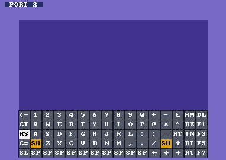

# Commodore 64 for Analogue Pocket

An openFPGA port of [C64_MiSTer](https://github.com/MiSTer-devel/C64_MiSTer), the MiSTer project's
Commodore 64 core (Sorgelig and contributors, built on Peter Wendrich's FPGA64), to the Analogue Pocket.

> **Status: early pre-release, not yet tested on hardware.** The bitstream builds, and the
> Pocket-specific parts are tested in simulation (see [Tests](#tests)). If something goes wrong, see
> [Troubleshooting](#troubleshooting) and please [open an issue](https://github.com/defgenx/openfpga-C64/issues).

## Features

* C64 and C64C (6581 or 8580 SID, 6569/8565 VIC-II, 6526/8521 CIA), PAL and NTSC
* Ready to run: the C64 and 1541 ROMs come with the core; no BIOS file needed
* A **1541 disk drive** with `.d64` and `.g64` images, read **and write** (writes go back to the file on
  the card in the background); it becomes a 1581 for `.d81` images
* `.prg` programs (loaded and started with RUN), `.crt` cartridges, `.tap` tapes
* Loadable System ROM: JiffyDOS, DolphinDOS, SpeedDOS (same files as on MiSTer)
* REU up to 16 MB, second SID (stereo), C128 / smart turbo
* 1351 mouse, user port 4-player adapter (Dock controllers 3 and 4)
* Playable handheld, no typing needed:
  * **autostart** — a disk or tape picked at the BASIC prompt is loaded and run (`LOAD"*",8,1` / `RUN`
    typed for you); picked during a game, it is just inserted, for disk swaps
  * joystick, keys and mouse pad modes (Start), on-screen keyboard (Select), joystick port swap (hold Select)
  * a loading screen with progress for cartridges, tapes and disk images

  

* Dock USB keyboard and mouse

## Installing

Put the microSD card in your computer and run the installer from the
[latest release](https://github.com/defgenx/openfpga-C64/releases):

| System        | Run                                                          |
|---------------|--------------------------------------------------------------|
| Windows       | put `install.bat` and `install.ps1` in one folder, double-click `install.bat` |
| macOS / Linux | `chmod +x install.sh && ./install.sh`                        |

It finds the Pocket card, copies the core and the guide, and offers to eject the card. It **asks before
replacing any file already on the card** (`[y]es / [N]o / [a]ll / [s]kip all`; Enter keeps your file).
Or unzip `defgenx.C64.zip` onto the card root by hand.

On the Pocket: *openFPGA → Commodore 64*. It boots to BASIC. Put your files in `Assets/c64/common/` and
load them from *Core Settings → Program / Cartridge / Disk / Tape*. Full guide:
**[INSTALL.md](INSTALL.md)**.

Installer options:

| macOS / Linux        | Windows          | Does                                                   |
|----------------------|------------------|--------------------------------------------------------|
| `--dry-run`          | `-DryRun`        | show what would be copied, change nothing              |
| `--sd /Volumes/NAME` | `-SD E:\`        | install to this card instead of searching for it       |
| `--reset-settings`   | `-ResetSettings` | also erase the core's saved settings (asks first)      |

## Loading software

| File                | Slot        | What happens                                                         |
|---------------------|-------------|----------------------------------------------------------------------|
| `.prg`              | Program     | the C64 resets, the program is put in memory and `RUN` is typed      |
| `.crt`              | Cartridge   | the C64 restarts with the cartridge; *Reset & Detach Cart* removes it |
| `.d64` `.g64` `.d81`| Disk        | at the BASIC prompt: loaded and run (autostart); otherwise inserted in drive 8 |
| `.tap`              | Tape        | at the BASIC prompt: loaded and run (Shift + Run/Stop typed for you)  |
| `.rom` `.bin`       | System ROM  | replaces the C64 + 1541 ROMs (MiSTer's format: BASIC + KERNAL + 1541) |

`.t64` files are not listed (the Pocket shows only the extensions above). A `.t64` wraps a program: with
the card in your computer, double-click **`convert-t64.command`** (macOS) or **`convert-t64.bat`**
(Windows). It finds the card and writes a `.prg` next to every `.t64` in `Assets/c64/common` and its
subfolders; load those as a Program. Existing `.prg` files are kept, so run it again after adding games.

Autostart only types when the C64 is at the BASIC prompt, so a disk picked while a game asks for
"side 2" is simply swapped in. Set *Autostart* to *Off* to always insert disks without typing. Disks and
the System ROM are remembered and come back at the next start (and autostart then runs the disk);
programs, cartridges and tapes are not. Writing to a disk is saved to its file on the card a moment later (½ s after the drive stops
writing); set *Write Protect* to keep a disk unchanged.

## Controls

No keyboard needed. **Start** cycles the pad between three modes; a JOYSTICK / KEYS / MOUSE label
confirms each switch. It starts in joystick mode.

| Button     | Joystick (default)        | Keys          | Mouse (1351, port 1) | On-screen keyboard  |
|------------|---------------------------|---------------|----------------------|---------------------|
| D-pad      | joystick                  | cursor keys   | move the pointer     | move the key cursor |
| A          | fire                      | Space         | left button          | press the key       |
| B          | Space                     | Return        | right button         | close the keyboard  |
| X          | Return                    | F1            | Space                | –                   |
| Y          | F1                        | F3            | Return               | –                   |
| L          | Run/Stop                  | Run/Stop      | Run/Stop             | –                   |
| R          | F7                        | F5            | F1                   | –                   |
| **Select** | show keyboard; **hold**: swap joystick port | show keyboard | show keyboard | close the keyboard  |
| **Start**  | → keys                    | → mouse       | → joystick           | –                   |

The pad is joystick **port 2** by default, where most games read it. If a game ignores the joystick,
**hold Select** for a moment: the pad moves to the other port (a PORT 1 / PORT 2 label confirms it).
*Joystick Port* in the menu sets the port it starts on. A second controller in the Dock is the other port. On the on-screen keyboard CTRL, SHIFT and C= are sticky:
press SHIFT, then the key. `RS` is Run/Stop, `RE` Restore, `HM` Clr/Home, `DL` Inst/Del, `SL` Shift Lock.
In the Dock, a USB keyboard works like the C64's (Esc = Run/Stop, Tab = C=, F11 = Restore,
Home = Clr/Home). Details: [docs/input.md](docs/input.md).

## Core settings

On the Pocket: press the Analogue button while the core runs → *Core Settings*.

| Setting             | Values                                   | Notes                                                |
|---------------------|------------------------------------------|------------------------------------------------------|
| Reset               | –                                        | resets the C64, keeps the cartridge                  |
| Reset & Detach Cart | –                                        | resets without the cartridge                         |
| Model               | C64 (6581 SID) / C64C (8580 SID)         | also picks the VIC-II and CIA of that model          |
| Video               | PAL / NTSC                               | resets the C64; most European software needs PAL     |
| Joystick Port       | Port 2 / Port 1                          | which port the Pocket's pad is                        |
| Pad Mode            | Joystick / Keys / Mouse                  | the mode the pad starts in; Start cycles them        |
| Second SID          | Off / D420 / D500 / DE00 / DF00          | stereo: the second SID on the right channel          |
| Autostart           | On / Off                                 | load and run a disk or tape picked at the BASIC prompt |
| REU                 | Off / 512 KB / 2 MB / 16 MB              | RAM Expansion Unit                                   |
| Write Protect       | Off / On                                 | applies to the next disk inserted                    |
| Borders             | Show / Hide                              | hide to fill the screen with the 320×200 area        |
| Palette             | Colodore, Ultimate, Pepto, VICE …        |                                                      |
| Drive Display       | Activity / If Mounted / Off              | drive number and track on screen (red while writing) |
| Tape Play/Pause     | –                                        | the tape normally starts and stops by itself         |
| Turbo               | Off / C128 / Smart                       | faster CPU for software that supports it             |
| Reset All Settings  | –                                        | every setting back to its default, then a reset      |

Settings are saved on the card (`Settings/defgenx.C64/`) and come back at the next start.

## Troubleshooting

| What you see | What to do |
|---|---|
| **"Load error in 'core'" / "General error"** when starting the core | An old or mixed install. Run the installer again and answer **a** (replace all), or delete `Cores/defgenx.C64/` from the card first. |
| **Black or rolling picture after changing a setting** | *Core Settings → Reset All Settings*. If the menu doesn't help: `./install.sh --reset-settings` (Windows: `install.bat -ResetSettings`), or delete `Settings/defgenx.C64/` on the card. |
| **`?DEVICE NOT PRESENT ERROR`** | No disk in the drive: pick one in *Disk*. Only drive 8 exists. A `.d64` smaller than 174,848 bytes is not a disk image. |
| **The joystick does nothing** | Press **Start** until the label shows JOYSTICK, then **hold Select** to swap the port. |
| **A disk did not start by itself** | The C64 was not at the BASIC prompt (or *Autostart* is off): *Reset*, then pick the disk again, or type `LOAD"*",8,1` and `RUN`. |
| **A game runs too fast / music too high** | It is an NTSC game on PAL or the reverse: change *Video*. |
| **A game cannot save** | *Write Protect* is on (re-insert the disk after changing it). |
| **A folder of games looks empty** | The files are not a type the core loads (`.t64`, `.zip`, …): double-click `convert-t64.command` / `.bat` for `.t64`, unzip archives. |
| **A protected disk does not load** | Try the `.g64` version of the disk; `.d64` cannot hold copy protection. |

When reporting a problem, please say which version (`version` in `Cores/defgenx.C64/core.json`), the
settings you changed, and what is on screen.

## Building

Requirements: Quartus Prime Lite 21.1 (the Pocket's Cyclone V 5CEBA4), or Docker, plus Python 3.

```sh
git clone --recursive <this repo>
./build.sh            # compile (native quartus_sh if on PATH, else the raetro/quartus Docker image) and package
./build.sh package    # only package an existing src/fpga/output_files/ap_core.rbf
```

On Apple Silicon the Docker build runs under x86 emulation and is slow; the image needs ~15 GB of free
space in Docker's VM.

## Tests

```sh
make -C sim           # needs Icarus Verilog, Python 3 and nvc (VHDL)
```

* `gcr`: the FPGA's D64 → GCR track synthesis is checked byte for byte against a port of Main_MiSTer's
  `c64_synthesize_gcr_track()` on every speed zone, and the GCR → D64 decoder on tracks rotated by any
  number of bits and with a damaged sector header.
* `hid`: `hid_c64` key make/break events and mouse reports.
* `media`: `c64_media` + `ddram_psram` against models of APF's target commands, the Pocket's PSRAM and
  the C64 — PRG streaming with `ioctl_wait`, a D64 mounted as a G64 identical to MiSTer's, a 1541 track
  written back into D64 sectors, a G64 copied and written back, D81 sectors read and written.
* `autostart`: `LOAD"*",8,1` / `RUN` typed for a disk at the prompt, Shift+Run/Stop for a tape, nothing
  for a disk swapped in during a game.
* `osk`: renders the on-screen keyboard and the loading screen to `sim/video/*.png`.
* `video`: `c64_video` fed with C64_MiSTer's own VIC-II and `video_sync` (simulated with nvc): exact
  line and frame sizes for PAL/NTSC with and without borders, and the 320×200 window exactly on the
  display area.

## Known gaps

* Not yet tested on a real Pocket: SDRAM timing and PSRAM in particular need confirming.
* One drive (8) instead of MiSTer's two, and no OPL2 Sound Expander: with both, the core needs ~20% more
  logic than the Pocket's FPGA has. Two-disk games are played by swapping disks in drive 8.
* No 1571 / `.d71`, no EasyFlash saving back to the `.crt`, no `.t64` (convert to `.d64`).
* No user port RS-232, no paddles, no external IEC.
* The RTC is set once at boot (used by GEOS with the CP-Clock F83 driver).

## Documentation

* [docs/architecture.md](docs/architecture.md) — how the MiSTer framework was replaced, media flow, settings map
* [docs/video.md](docs/video.md) — measured VIC-II windows and scaler modes
* [docs/input.md](docs/input.md) — controls, Dock keyboard/mouse translation, on-screen keyboard

## Credits and licence

* [C64_MiSTer](https://github.com/MiSTer-devel/C64_MiSTer) by Sorgelig and contributors — FPGA64 by
  Peter Wendrich, the 1541/1581 by darfpga, Sorgelig and Robin Wünderlich, the SID by Dar and
  contributors — GPL. Included unmodified as a submodule; `c64_top.sv` is derived
  from its `c64.sv`. The D64 ↔ GCR conversion follows
  [Main_MiSTer](https://github.com/MiSTer-devel/Main_MiSTer)'s `support/c64/c64.cpp` (GPL).
* Analogue's [openFPGA core template](https://github.com/open-fpga/core-template) (`src/fpga/apf`,
  `core_bridge_cmd.v`).
* `psram.sv`, `sound_i2s.sv` and `sync_fifo.sv` from
  [analogue-pocket-utils](https://github.com/agg23/analogue-pocket-utils) by Adam Gastineau — MIT.
* On-screen keyboard font: [font8x8](https://github.com/dhepper/font8x8) by Daniel Hepper — public domain.

The Pocket-specific code in this repository is distributed under the GPL (v2 or later), like the core it
builds on.
